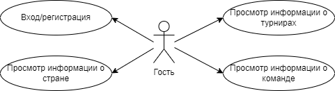
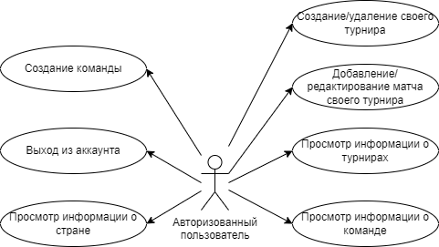
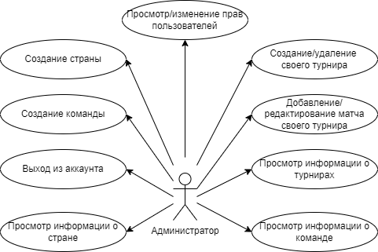
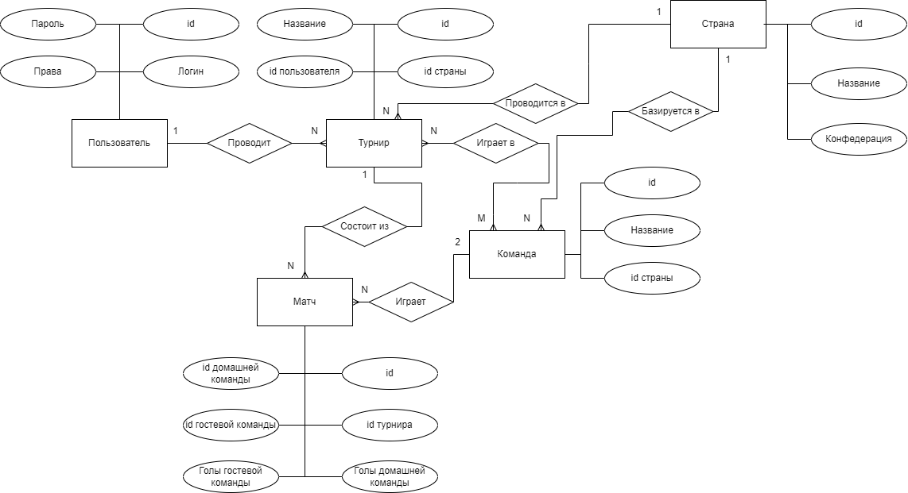
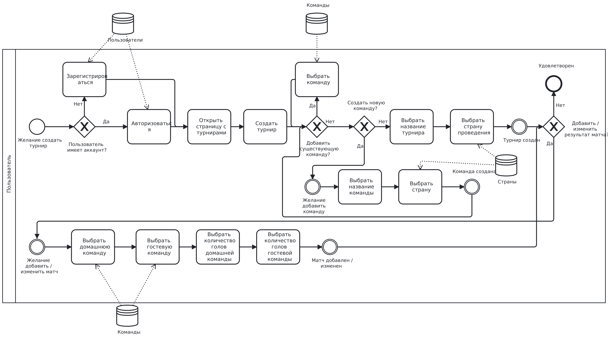
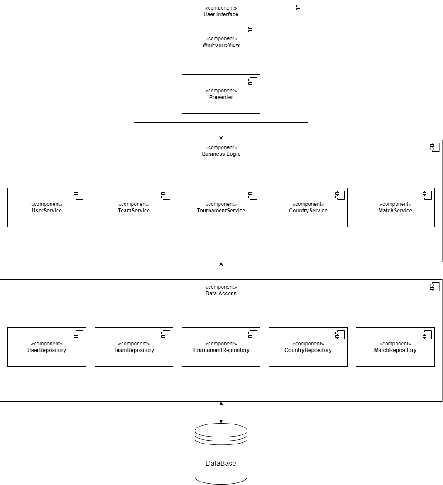
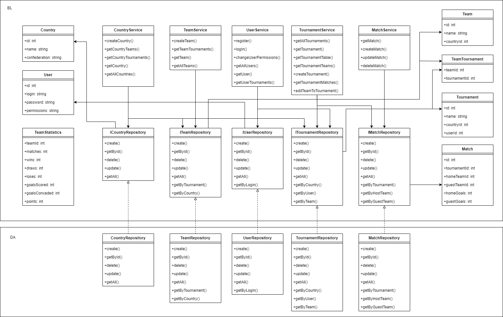

# Лабораторная работа № 1
## Название
Приложение для создания футбольных турниров
## Краткое описание идеи проекта
Desktop-приложение для проведения футбольных турниров и генерации турнирных таблиц. Для создания турнира можно выбрать уже существующие команды либо же создать новые. Пользователь может вносить результаты матчей в таблицу, а также просматривать информацию о чужих турнирах и о странах (командах из определенной страны и турнирах, проводящихся в ней).
## Краткое описание предметной области
Предметная область - футбольные турниры. Сущности - пользователь, турнир, команда, страна, матч.
## Краткий анализ аналогичных решений по 3 критериям
|Название|Просмотр чужих турниров|Создание турнира с существующими командами|Просмотр информации о стране|
|--------|----------|------------------------|--------------|
|oball.ru|+|+|-|
|sportorg.ru|+|-|-|
|tlab.pro|-|-|-|
## Краткое обоснование целесообразности и актуальности проекта
Данное приложение может помочь не только в проведении турниров, но в просмотре статистики команд во всех турнирах, в которых они участвуют.
## Use-Case - диаграмма

## ER-диаграмма сущностей

## Пользовательские сценарии
Пользователь может:

1. Авторизоваться
2. Зайти на страницу турнира, просмотреть результаты матчей и турнирную таблицу
3. Зайти на страницу своего турнира и внести результат матча в таблицу
4. Создать новый турнир, добавить в него существующие команды или создать новые
5. Зайти на страницу команды и посмотреть, в каких турнирах она участвует
6. Зайти на страницу страны и посмотреть, какие турниры проводятся в ней
7. Зайти на страницу страны и посмотреть, какие команды базируются в этой стране
8. Изменить результат матча своего турнира
9. Выйти из аккаунта
## Формализация бизнес-правил

## Тип приложения и технологический стек

Тип приложения - Desktop MVP

Технологический стек - C#, PostgreSQL, Windows Forms

## Диаграмма компонентов

## UML

